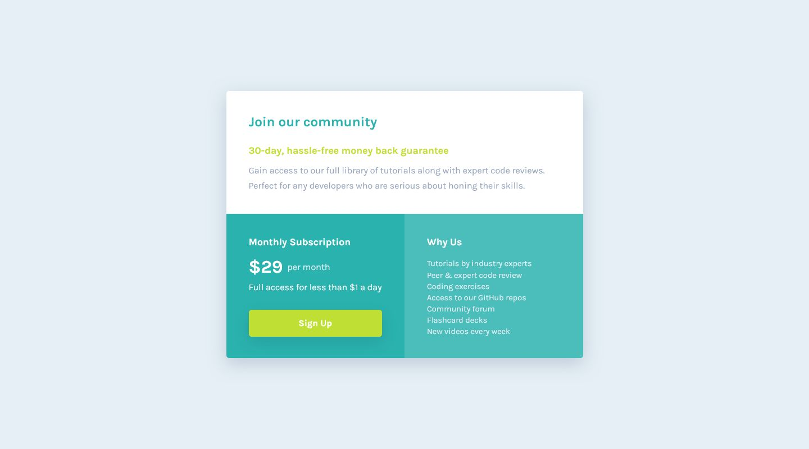

# Frontend Mentor - QR code component solution

This is a solution to the [Single price grid component challenge on Frontend Mentor](https://www.frontendmentor.io/challenges/single-price-grid-component-5ce41129d0ff452fec5abbbc). Frontend Mentor challenges help you improve your coding skills by building realistic projects.

## Table of contents

- [Overview](#overview)
  - [Screenshot](#screenshot)
  - [Links](#links)
- [My process](#my-process)
  - [Built with](#built-with)
  - [What I learned](#what-i-learned)
- [Author](#author)

## Overview

Hi! This is my attempt at the Single price grid component challenge.

This challenge was relatively straightforward. My overall approach and my nesting structure in SASS was to go section by section, making sure each section matched the design images before working on responsive styling.

### Screenshot

Desktop

Mobile

### Links

- Solution URL: [Here!](https://github.com/sheronimo/frontendmentor-singlepricegrid)
- Live Site URL: [Here!](https://sheronimo.github.io/frontendmentor-singlepricegrid/)

## My process

1. I went for a mobile-first approach, wherein each section was a 1fr-sized column in the grid.
2. I styled each section and fine-tuned the spacing and sizing of each element, by comparing screenshots to the design images, before moving on to the next section.
3. After completing all sections as they appeared on mobile, I then worked on the arrangement of the columns on medium-sized and larger screens.

### Built with

- Semantic HTML5 markup
- SASS
- Flexbox
- Grid

### What I learned

I learned about how to work with changing the size of specific grid items as they appear on different screen sizes. I initially thought of using `grid-template-areas`, but I found simply adjusting `grid-template-columns` on the grid itself, and the `span` of the top section to be a simpler approach.

## Author

- Github - [sheronimo](https://github.com/sheronimo)
- Frontend Mentor - [@sheronimo](https://www.frontendmentor.io/profile/sheronimo)
